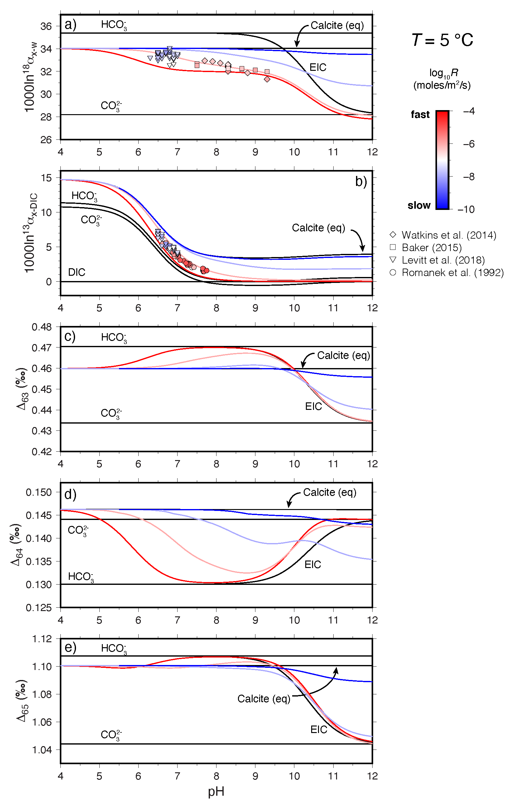
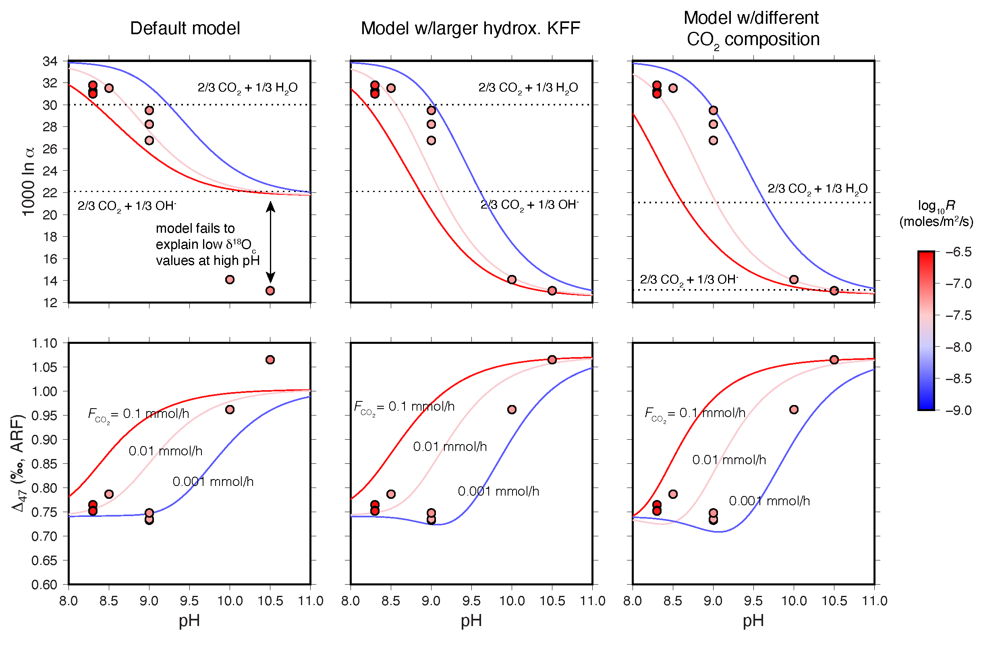

# ExClump388

## Description

This repository contains MATLAB scripts to compute the &delta;13C, &delta;18O, Δ47, Δ48, and Δ49 of calcite precipitated from a CO2-fed solution. The full descrition of the model and parameters can be found in: Watkins, J., and Devriendt, L., A generalizable box model for kinetic clumped isotope effects in the CaCO3-DIC-H2O system, submitted to Geochemistry, Geophysics, Geosystems.

If you use this code, I also recommend that you cite the following papers:

(1) Chen et al. (2018) and (2) Uchikawa et al. (2021)

BibTeX:

	@article{uchikawa2021trajectory,
	  title={Trajectory and timescale of oxygen and clumped isotope equilibration in the dissolved carbonate system under normal and enzymatically-catalyzed conditions at 25° C},
	  author={Uchikawa, Joji and Chen, Sang and Eiler, John M and Adkins, Jess F and Zeebe, Richard E},
	  journal={Geochimica et Cosmochimica Acta},
	  volume={314},
	  pages={313--333},
	  year={2021},
	  publisher={Elsevier}
	}
	@article{chen2018carbonic,
	  title={Carbonic anhydrase, coral calcification and a new model of stable isotope vital effects},
	  author={Chen, Sang and Gagnon, Alexander C and Adkins, Jess F},
	  journal={Geochimica et Cosmochimica Acta},
	  volume={236},
	  pages={179--197},
	  year={2018},
	  publisher={Elsevier}
	  }

## Requirements
In order to run the scripts you will need Matlab. The codes were produced using Matlab2017b but earlier and later versions will probably work just as well. 

## ExClump388 - A model for kinetic isotope effects attending reactions among DIC species and water
ExClump388 is a simplied version of IsoDIC (Guo, 2020).  The first script, <b>ExClump388_IsoDIC_comparison.m</b>, is a validation of the code and reproduces Fig. 2 of the paper. Note that this script uses exactly the same equilibrium and kinetic constants as Guo (2020), which differ from those used in the other scripts.  

[image here]

## Calcite388 - An ion-by-ion model for kinetic isotope effects attending calcite precipitation
Calcite388 is an update to the ion-by-ion model of Watkins and Hunt (2015) that now includes &Delta;64 and &Delta;65. Note that the new version uses the equilibrium  &delta;18O of CO2, HCO3-, and CO32- from Beck et al. (2005) instead of Wang et al. (2013). This led to changes in the KFFs for the HCO3-&#x2192;CaCO3 and CO32-&#x2192;CaCO3 reactions. The script <b>Ion_by_ion_D61_D62_D63_D64_D65.m</b> was used to produce Fig. 5 of the paper. To run, simply download the script along with the following data files: 
<ul>
	<li>Romanek_to_5C.m
	<li>Baker_to_5C.m
	<li>Watkins_to_5C.m
	<li>Levitt_to_5C.m
</ul>
and execute the script. This will produce a figure with 5 panels showing the &delta;13C, &delta;18O, &Delta;47, &Delta;48, and &Delta;49 of DIC species and calcite as a function of pH for a specified growth rate. To change the growth rate, modify the value of 'Rate_spec' on line 27 of <b>Ion_by_ion_D61_D62_D63_D64_D65.m</b>.  

## The combined ExClump388-Calcite388 Box Model
ExClump388 describes isotope reaction kinetics in the DIC-H2O system and Calcite388 describes isotope reaction kinetics in the CaCO3-DIC system.  This script stitches these two models together to describe isotope reaction kinetics in the full CaCO3-DIC-H2O system in the special case where there is a constant CO2 flux. 

The following scripts are required: 
<ul>
	<li>Calcite388.m - this is the ion-by-ion function script
	<li>ExClump388_Calcite388_Box_Model.m - this is the main script that calls Calcite388.m at each timestep
	<li>Run_ExClump388_Calcite388_Box_Model.m - this is a post-processing script for plotting the outputs
	<li>Tang_5C.m - data from Tang et al. (2014)
</ul>
To run, put all files in same directory and execute <b>Run_ExClump388_Calcite388_Box_Model</b>. This will output a set curves for the &delta;18O and &Delta;47 of calcite as a function of pH for a specified <i>F</i>CO2.  The value of <i>F</i>CO2 can be changed on line 32 of <b>ExClump388_Calcite388_Box_Model</b>.

