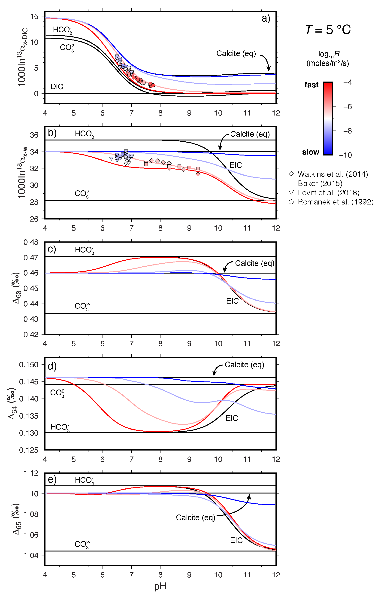
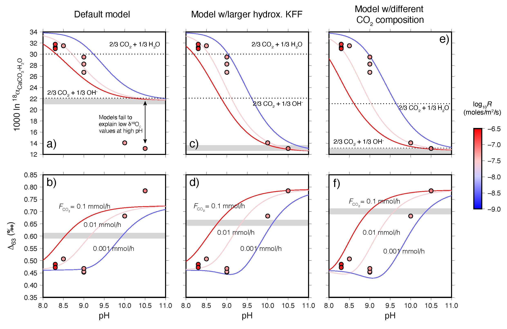

# COAD Box Model

## Description

This repository contains MATLAB scripts to compute the &delta;13C, &delta;18O, Δ47, Δ48, and Δ49 of calcite precipitated from a CO2-fed solution. The full descrition of the model and parameters can be found in: Watkins, J. and Devriendt, L. 2022, A combined model for kinetic clumped isotope effects in the CaCO3-DIC-H2O system, submitted to Geochemistry, Geophysics, Geosystems.

If you use these codes, I recommend that you also cite the following papers:
<ol>
	<li> Watkins, J.M. and Hunt, J.D., 2015. A process-based model for non-equilibrium clumped isotope effects in carbonates. Earth and Planetary Science Letters, 432, pp.152-165.
	<li> Chen, S., Gagnon, A.C. and Adkins, J.F., 2018. Carbonic anhydrase, coral calcification and a new model of stable isotope vital effects. Geochimica et Cosmochimica Acta, 236, pp.179-197.
	<li> Uchikawa, J., Chen, S., Eiler, J.M., Adkins, J.F. and Zeebe, R.E., 2021. Trajectory and timescale of oxygen and clumped isotope equilibration in the dissolved carbonate system under normal and enzymatically-catalyzed conditions at 25° C. Geochimica et Cosmochimica Acta, 314, pp.313-333.
</ol>

## Requirements
In order to run the scripts you will need Matlab. The codes were produced using Matlab2017b but earlier and later versions will probably work just as well. 

## Scripts

### 1. Ion_by_ion_D61_D62_D63_D64_D65.m - A model for kinetic isotope effects in the CaCO3-DIC system
This script provides an update to the ion-by-ion model of Watkins and Hunt (2015) in that it now includes &Delta;64 and &Delta;65. The script <b>Ion_by_ion_D61_D62_D63_D64_D65.m</b> was used to produce Fig. 2 of the paper. To run, simply download the script along with the following data files: 
<ul>
	<li>Romanek_to_5C.txt
	<li>Baker_to_5C.txt
	<li>Watkins_to_5C.txt
	<li>Levitt_to_5C.txt
</ul>
and execute the script. This will produce a figure with 5 panels showing the &delta;13C, &delta;18O, &Delta;47, &Delta;48, and &Delta;49 of DIC species and calcite as a function of pH for a specified growth rate. To change the growth rate, modify the value of 'Rate_spec' on line 27 of <b>Ion_by_ion_D61_D62_D63_D64_D65.m</b>.  

### 2. The combined COAD Box Model
The COAD box model allows one to calculate kinetic isotopes effects in the full CaCO3-DIC-H2O system. The script <b>Run_COAD_Box_Model.m</b> was used to produce Fig. 6 of the paper.

The following scripts are required: 
<ul>
	<li>CaCO3_DIC.m - this is the ion-by-ion function script
	<li>COAD_Box_Model.m - this is the main script that calls CaCO3_DIC.m at each timestep
	<li>Run_COAD_Box_Model.m - this is used to run COAD_Box_Model.m and post-process the outputs
	<li>Tang_5C.m - data from Tang et al. (2014)
</ul>
To run, put all files in same directory and execute <b>Run_COAD_Box_Model.m</b>. This will output a set curves for the 1000ln18&alpha; and &Delta;63 of calcite ('Default Model') as a function of pH for a specified <i>F</i>CO2.  The value of <i>F</i>CO2 can be changed in <b>COAD_Box_Model_.m</b>. The curves for the non-default models (middle and right panels) can be obtained by changing the parameters as instructed in the paper. 

